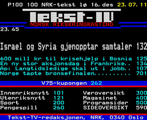

# Tekst-TV arkiv

Dette er en samling av sider fra tekst-TV hos, fortrinnsvis, NRK og TV2. Innholdet er hentet fra VHS- og Betamax-kassetter.

Samlingen er hentet ut ved å først foreta et RF-opptak av FM-signalet på videokassetten. Deretter dekodes dette ved hjelp av programvare fra [vhs-decode](https://github.com/oyvindln/vhs-decode)-prosjektet, slik at man ender opp med en TBC-fil som inneholder Y-signalet til videoen. En separat fil for C-signalet lages også i samme prosess, men denne er ikke relevant

Denne TBC-filen for Y-signalet mates så inn i en programvare utviklet av [ali1234](https://github.com/ali1234), kalt [vhs-teletext](https://github.com/ali1234/vhs-teletext). Denne programvaren leser VBI-området og henter ut den digitale informasjonen som inneholder tekst-TV-sidene. Man ender da opp med en såkalt T42-fil, som inneholder en strøm av datapakker. Denne kan man så videre eksportere til for eksempel HTML (slik som jeg har gjort i dette repoet), eller åpne i en teletext-editor for videre behandling. 

Videokassetter begynner å bli gamle, og selv om tekst-TV er konstruert for å være godt beskyttet mot feil, så vil selv de beste rekonstrueringene inneholde feil. Jeg har derfor gjennomgått hver side manuelt for å rette opp i eventuelle feil etter beste evne. 

Programvaren som jeg har brukt til å redigere tekst-TV-sidene direkte er blant annet [Teletext Meddler](https://andrewnile.co.uk/software/). Jeg har også gjort enkelte endringer direkte i HTML-filene, for eksempel for å legge til norske tegn. Teletext Meddler støtter (tilsynelatende) ikke det norske tegnsettet man finner i Level 1.5 av tekst-TV, og derfor ender blant annet Ø opp som Ö. 

